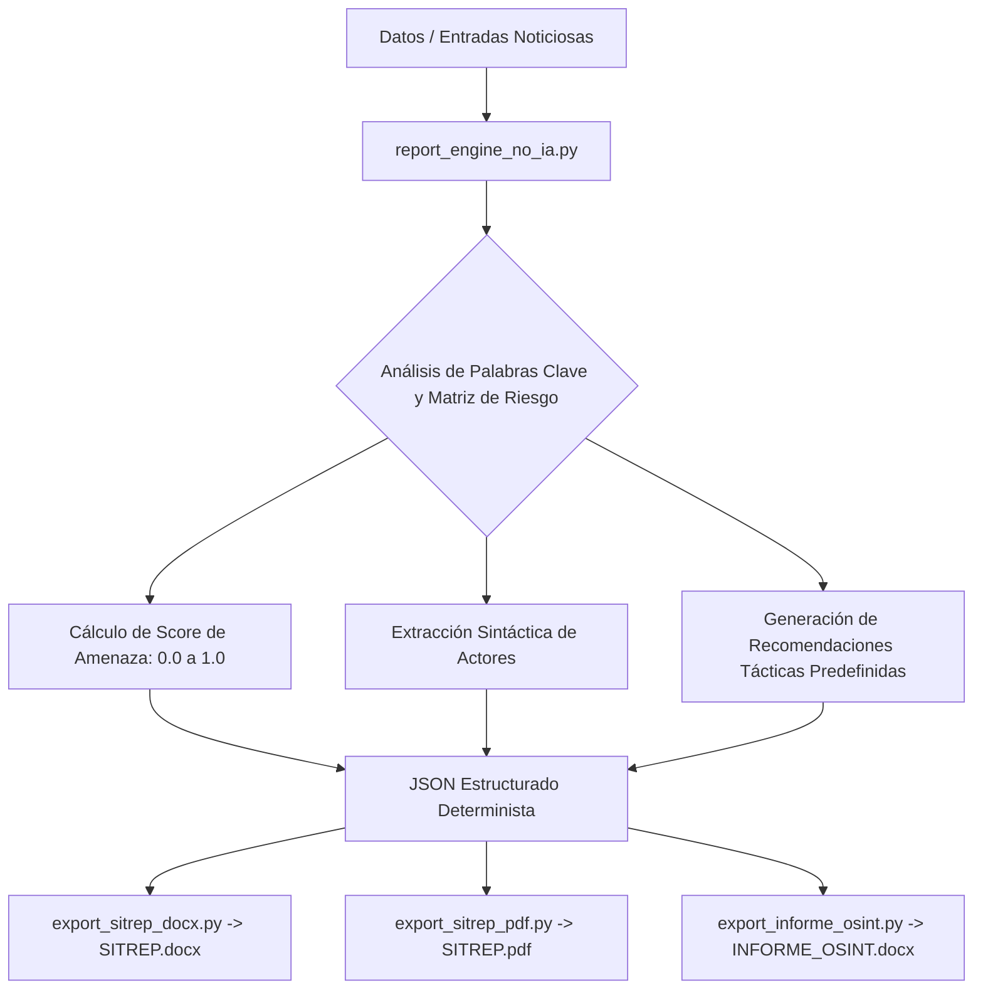

# 📊 Módulo Autónomo de Generación de Informes de Inteligencia (SIN IA / DETERMINISTA)

Este directorio contiene el motor completo de generación de informes de inteligencia, reportes de situación (SITREP) en **Microsoft Word (.docx)**, documentos en **PDF** y estructuración **JSON** extraído del ecosistema **COBALTO Hub**, **diseñado para funcionar al 100% de forma determinista, sin requerir OpenAI, LLM, claves API ni conexión a internet**.

---

## 📁 Estructura del Proyecto Exportado

```
EXPORT_NO_IA/
├── report_engine_no_ia.py    # Motor determinista de reglas, scoring de amenaza y extracción sintáctica
├── export_sitrep_docx.py     # Generador de reportes SITREP en Microsoft Word (.docx) estilizados
├── export_informe_osint.py   # Generador de informes ejecutivos OSINT con gráficos vectoriales Pillow y auditoría
├── export_sitrep_pdf.py      # Generador de reportes en PDF con banners de criticidad (requiere fpdf2)
├── example_usage.py          # Script de demostración para probar la generación de informes
└── README.md                 # Documentación técnica completa y guía de uso
```

---

## 📊 Arquitectura del Sistema Determinista



---

## ⚙️ ¿Cómo Funciona la Generación de Informes Sin IA?

1. **Matriz de Riesgo y Heurística de Palabras Clave**:
   - Evalúa la densidad de términos críticos (*"ataque"*, *"ransomware"*, *"apariencia"*, *"apabullante"*, *"desastre"*) asignando ponderaciones fijas (Crítica +0.35, Alta +0.20, Media +0.08).
   - Genera una clasificación determinista e inmutable: `CRÍTICA` (≥0.70), `ALTA` (≥0.40), `MEDIA` (≥0.20), `BAJA` (<0.20).

2. **Extracción Sintáctica de Actores y Organizaciones**:
   - Mediante expresiones regulares optimizadas identifica instituciones (*FANB, PNB, SEBIN, DGCIM, BCV, PDVSA, etc.*) sin llamar a ningún modelo de lenguaje.

3. **Formateo de Documentos Profesionales**:
   - **DOCX**: Utiliza `python-docx` y manipulaciones OXML para aplicar tablas fijas, fondos de celda, banderas confidenciales y banners de cabecera.
   - **PDF**: Genera layouts vectoriales en PDF utilizando `fpdf2` con headers y footers paginados.
   - **Pillow Logo**: Renderiza dinámicamente el escudo institucional en memoria PNG sin requerir imágenes externas.

---

## 🚀 Requisitos e Instalación

Instala las dependencias necesarias en tu proyecto destino (todas son librerías estándar de procesamiento de documentos en Python):

```bash
pip install python-docx fpdf2 pillow
```

---

## 💻 Ejemplo de Uso Rápido

```python
from report_engine_no_ia import procesar_entrada_determinista
from export_sitrep_docx import generate_sitrep_docx_bytes

# 1. Procesar noticia o evento determinísticamente
resultado = procesar_entrada_determinista(
    titulo="Falla en la estación eléctrica principal",
    contenido="Personal técnico realiza maniobras de recuperación.",
    fuente="Prensa Regional"
)

print("Nivel de Amenaza:", resultado["nivel_amenaza"])
print("Actores Detectados:", resultado["actores"])

# 2. Exportar a Word (.docx)
docx_bytes = generate_sitrep_docx_bytes({"entries": [resultado]})
with open("SITREP_FINAL.docx", "wb") as f:
    f.write(docx_bytes)
```

---

## 🧪 Verificación Directa

Para probar la generación de informes en JSON, Word y PDF en tu equipo, ejecuta:

```bash
python EXPORT_NO_IA/example_usage.py
```
