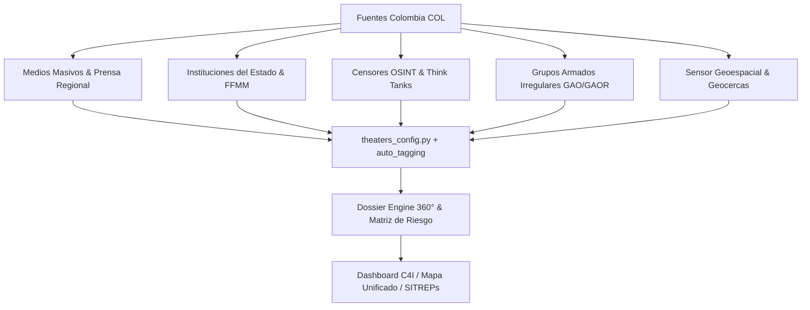

# 🇨🇴 COBALTO HUB — MANUAL COMPLETO DE FUENTES DE INTELIGENCIA Y MONITOREO DE COLOMBIA (`COL`)

**Sistema de Mando y Control C4I — Arquitectura de Vigilancia y Cobertura Operacional Colombia v14.0**

Este documento recopila el inventario exhaustivo de **todas las fuentes, medios de comunicación, instituciones del Estado, grupos armados, actores políticos, analistas, geocercas y conjuntos de datos tácticos** configurados en el proyecto COBALTO para la vigilancia y el análisis de inteligencia en tiempo real sobre el territorio colombiano.

---

## 📊 Arquitectura General del Teatro Colombia (`COL`)



### Metadatos Operativos del Teatro:
- **Código de Teatro**: `COL`
- **Icono / Bandera**: 🇨🇴
- **Centro Geoespacial**: Latitud `6.5° N`, Longitud `-70.0° W` (Zoom por defecto: `5`)
- **Geocerca Sísmica**: Latitud `4.7110° N`, Longitud `-74.0721° W` (Bogotá), Radio `600 km`

---

## 🌐 1. Medios de Comunicación y Portales de Prensa (25 Fuentes)

El sistema monitorea y extrae contenidos de forma continua a través de 25 medios abiertos y especializados de Colombia:

| Portal / Medio | Dominio Monitoreado | Cobertura / Enfoque Táctico |
|---|---|---|
| **Noticias Caracol** | `noticias.caracoltv.com` | Televisión / Medio masivo nacional |
| **Noticias RCN** | `noticiasrcn.com` | Televisión / Noticias en vivo / Telegram |
| **Caracol Radio** | `caracol.com.co` | Cadena radial nacional / Orden público |
| **W Radio Colombia** | `wradio.com.co` | Radio / Investigaciones y entrevistas |
| **Revista Semana** | `semana.com` | Exclusivas / Cobertura de seguridad y política |
| **El Tiempo** | `eltiempo.com` | Prensa nacional / Cobertura institucional |
| **El Espectador** | `elespectador.com` | Prensa nacional / Judiciales y DDHH |
| **Blu Radio** | `bluradio.com` | Radio nacional / Movilidad y última hora |
| **La FM** | `lafm.com.co` | Emisora radial / Opinión y política |
| **Radio Nacional** | `radionacional.co` | Emisora institucional del Estado |
| **RCN Radio** | `rcnradio.com` | Cadena radial nacional |
| **Cambio Colombia** | `cambiocolombia.com` | Periodismo de investigación y poder |
| **La Silla Vacía** | `lasillavacia.com` | Análisis político y redes de poder |
| **Cuestión Pública** | `cuestionpublica.com` | Periodismo de investigación y corrupción |
| **Vorágine** | `voragine.co` | DDHH, orden público y narcotráfico |
| **Verdad Abierta** | `verdadabierta.com` | Conflicto armado, paramilitarismo y justicia |
| **Fundación Pares** | `pares.com.co` | Monitoreo de violencia y crimen organizado |
| **El Colombiano** | `elcolombiano.com` | Prensa regional (Antioquia / Urabá / Bajo Cauca) |
| **El País (Cali)** | `elpais.com.co` | Prensa regional (Valle / Cauca / Nariño) |
| **Vanguardia** | `vanguardia.com` | Prensa regional (Santanderes) |
| **La Opinión** | `laopinion.com.co` | Prensa fronteriza (Norte de Santander / Táchira) |
| **El Heraldo** | `elheraldo.co` | Prensa regional (Costa Caribe) |
| **Periódico del Meta** | `periodicodelmeta.com` | Prensa regional (Llanos Orientales / Guaviare) |
| **La Nación (Huila)** | `lanacion.com.co` | Prensa regional (Sur de Colombia / Caquetá) |
| **France 24 (Colombia)** | `france24.com` | Cobertura internacional dedicada a Colombia |

---

## 🏛️ 2. Instituciones del Estado, Gobierno y Fuerza Pública

COBALTO rastrea comunicados oficiales, alertas tempranas y decretos de los siguientes organismos estatales:

| Institución / Organismo | Identificador / Dominio | Rol en Inteligencia |
|---|---|---|
| **Presidencia de la República** | `infopresidencia` / Casa de Nariño | Decretos ejecutivos y declaraciones oficiales |
| **Ministerio de Defensa Nacional** | `mindefensa.gov.co` / `@mindefensa` | Operaciones de seguridad y orden público |
| **Comando General Fuerzas Militares** | `cgfm.mil.co` / `@FuerzasMilCol` | Operaciones militares conjuntas |
| **Ejército Nacional de Colombia** | `ejercito.mil.co` / `@Ejercito_Col` | Despliegue en terreno y combate terrestre |
| **Armada de Colombia** | `armada.mil.co` / `@ArmadaColombia` | Interdicción marítima y fluvial / Guardacostas |
| **Fuerza Aeroespacial Colombiana** | `fac.mil.co` / `@FuerzaAereaCol` | Vigilancia aérea y reconocimiento BFT |
| **Policía Nacional de Colombia** | `policia.gov.co` / `@PoliciaColombia` | Capturas, inteligencia judicial y seguridad |
| **Fiscalía General de la Nación** | `fiscalia.gov.co` / `@FiscaliaCol` | Judicialización de organizaciones criminales |
| **Defensoría del Pueblo** | `defensoria.gov.co` / `@DefensoriaCol` | **Sistema de Alertas Tempranas (SAT)** |
| **Unidad Nacional de Protección** | `unp.gov.co` / `@UNPColombia` | Evaluación de riesgo a personas y comunidades |
| **Unidad de Información y Análisis Financiero**| `uiaf.gov.co` | Monitoreo de lavado de activos y FININT |
| **Jurisdicción Especial para la Paz (JEP)** | `JEP` | Macrocasos y justicia transicional del conflicto |

---

## 🪖 3. Grupos Armados Organizados (GAO) y Frentes en Vigilancia

Rastreo directo en expedientes tácticos y noticias sobre los siguientes actores armados irregulares:

| Grupo Armado / Frente | Siglas / Alias | Zona de Operaciones Principal |
|---|---|---|
| **Ejército de Liberación Nacional** | `ELN` | Arauca, Catatumbo, Chocó, Nariño, Cauca |
| **Estado Mayor Central** | `EMC` / Disidencias FARC | Cauca, Valle, Meta, Guaviare, Caquetá, Huila |
| **Segunda Marquetalia** | Disidencias FARC | Nariño, Putumayo, Frontera con Venezuela |
| **Clan del Golfo** | `AGC` / `EGC` (Gaitanistas) | Urabá, Chocó, Córdoba, Sucre, Bajo Cauca |
| **Comandos de la Frontera** | `CDF` | Putumayo, frontera ecuatoriano-peruana |
| **Los Pachencas** | `ACSN` (Sierra Nevada) | Santa Marta, Magdalena, La Guajira |
| **Frente Carlos Patiño** | Frente EMC | Cañón del Micay (Cauca) |
| **Frente 33** | Frente EMC | Catatumbo (Norte de Santander) |
| **Frente Adán Izquierdo** | Frente EMC | Valle del Cauca y Cauca |
| **Tren de Aragua (Frontera COL-VEN)** | Transnacional | Bogotá, Cúcuta, Maicao, Villa del Rosario |

### Comandantes Irregulares Rastreados:
- **Calarcá** (Alexander Díaz Mendoza - Comandante EMC)
- **Antonio García** (Eliécer Herlinto Chamorro Acosta - Máximo Comandante ELN)
- **Iván Márquez** (Luciano Marín Arango - Jefe Segunda Marquetalia)
- **Chiquito Malo** (Jobanis de Jesús Ávila Villadiego - Comandante Clan del Golfo)

---

## 👤 4. Figuras Políticas, Analistas y Cuentas de Twitter/X (`target_users`)

Monitoreo continuo de cuentas verificadas para medir presión mediática y análisis estratégico:

```text
@infopresidencia    Presidencia de Colombia
@FuerzasMilCol      Fuerzas Militares de Colombia
@PoliciaColombia    Policía Nacional
@mindefensa         Ministerio de Defensa
@Ejercito_Col       Ejército Nacional
@ArmadaColombia     Armada de Colombia
@FuerzaAereaCol     Fuerza Aeroespacial Colombiana
@FiscaliaCol        Fiscalía General
@DefensoriaCol      Defensoría del Pueblo (Alertas SAT)
@UNPColombia        Unidad Nacional de Protección
@petrogustavo       Gustavo Petro (Presidente)
@FranciaMarquezM    Francia Márquez (Vicepresidenta)
@laurisarabia       Laura Sarabia (DAPRE)
@ArielAvilaAnaliza  Ariel Ávila (Senador / Analista de Seguridad)
@LeonVaLenciaA      León Valencia (Director Fundación Pares)
@FIP_Col            Fundación Ideas para la Paz
@Indepaz            INDEPAZ (Masacres y Líderes Sociales)
@DanielMejiaL       Daniel Mejía (Criminología y Seguridad)
@lasillavacia       La Silla Vacía (Análisis Político)
@MariaFdaCabal      María Fernanda Cabal (Senadora / Oposición)
@PalomaValenciaL    Paloma Valencia (Senadora)
@VickyDavilaH       Vicky Dávila (Periodista)
@AlvaroUribeVel     Álvaro Uribe Vélez (Ex-Presidente)
@FicoGutierrez      Federico Gutiérrez (Alcalde de Medellín)
```

---

## 🔑 5. Set de Palabras Clave y Términos de Vigilancia (`keywords`)

Términos configurados en `data/theaters/colombia.json` para auto-clasificación de noticias, alertas y tweets en el teatro `COL`:

```text
colombia, bogotá, bogota, medellín, medellin, cali, barranquilla, bucaramanga, cúcuta,
cucuta, arauca, catatumbo, cauca, nariño, chocó, putumayo, guaviare, meta, maicao, tumaco,
urabá, bajo cauca, eln, ejército de liberación nacional, frente de guerra oriental,
estado mayor central, emc, frente 33, dagoberto ramos, jaime martínez, segunda marquetalia,
clan del golfo, gaitanistas, chiquito malo, disidencias farc, tren de aragua, paz total,
sat defensoría, alerta temprana, petro, abelardo de la espriella, adle, iván cepeda,
ffmm colombia, casa de nariño, fiscalía colombia
```

---

## 🏗️ 6. Infraestructura Crítica Monitoreada

- **Oleoducto Caño Limón-Coveñas**: Vigilancia de atentados, voladuras y derrames en Arauca, Norte de Santander y Cesar.
- **Ecopetrol S.A.**: Monitoreo de producción, paros de transporte de crudo y operaciones energéticas.

---

## 🔄 7. Integración en los Módulos del Sistema

1. **Auto-Etiquetado (`theaters_config.py`)**: Evalúa el texto, dominio y fuentes detectando automáticamente si una noticia pertenece a `COL`.
2. **Auto-Harvester (`keyword_harvester.py`)**: Cosecha hashtags emergentes sobre Colombia (ej: `#Catatumbo`, `#Cauca`, `#PazTotal`) y los añade automáticamente a la lista activa de monitoreo.
3. **Dossier Táctico 360° (`dossier_engine.py`)**: Permite consultar el expediente completo de cualquier entidad colombiana (ej. *ELN*, *Gustavo Petro*, *Mindefensa*) devolviendo su índice de riesgo (0-10) y cronología de eventos.
4. **Filtro Dinámico en UI (`switchTheater('COL')`)**: Al seleccionar **🇨🇴 Colombia** en la barra lateral, el mapa Leaflet vuela a las coordenadas de Colombia (`6.5, -70.0`) y filtra instantáneamente todas las tarjetas de noticias.
